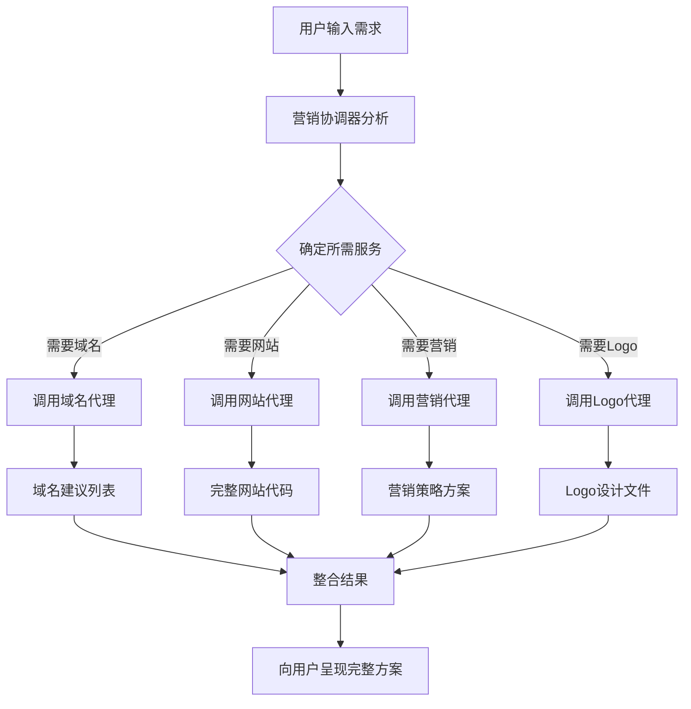

# 营销代理智能体

## 🎯 智能体概述

营销代理智能体是一个基于Google ADK构建的多代理协作系统，专门用于帮助用户建立强大的在线营销。该系统采用分层架构，通过4个专业子代理协同工作，提供从域名选择到网站创建、营销策略制定和Logo设计的全流程服务。

### 核心特性
- **多代理协作架构**：主控制器 + 4个专业子代理
- **端到端服务**：从域名到完整在线形象的一站式解决方案
- **智能化决策**：基于Gemini 2.5 Pro的高级AI推理能力
- **模块化设计**：每个子代理专注特定领域，易于维护和扩展
- **实际可用输出**：生成真实可部署的网站代码和营销材料

## 🏗️ 系统架构分析

### 主控制器（Marketing Coordinator）
```
marketing_coordinator (LlmAgent)
├── 模型: gemini-2.5-pro-preview-05-06
├── 角色: 营销专家和项目协调者
└── 工具集成:
    ├── domain_create_agent
    ├── website_create_agent
    ├── marketing_create_agent
    └── logo_create_agent
```

### 子代理架构

#### 1. 域名创建代理 (Domain Create Agent)
- **功能**：域名建议和可用性验证
- **模型**：gemini-2.5-pro-preview-05-06
- **工具**：google_search（域名可用性检查）
- **输出**：10个可用域名建议列表

#### 2. 网站创建代理 (Website Create Agent)
- **功能**：完整网站代码生成
- **模型**：gemini-2.5-pro-preview-05-06
- **输出**：HTML/CSS/JS完整网站代码
- **特性**：响应式设计、SEO优化、现代UI/UX

#### 3. 营销创建代理 (Marketing Create Agent)
- **功能**：营销策略和内容创建
- **模型**：gemini-2.5-pro-preview-05-06
- **输出**：营销计划、内容策略、推广方案

#### 4. Logo创建代理 (Logo Create Agent)
- **功能**：品牌Logo设计和生成
- **模型**：gemini-2.5-pro-preview-05-06 + imagen-3.0-generate-002
- **输出**：高质量Logo图像文件
- **特性**：AI图像生成、品牌一致性

## 💻 代码结构分析

### 核心文件结构
```
marketing-agency/
├── marketing_agency/
│   ├── agent.py              # 主控制器实现
│   ├── prompt.py             # 主控制器提示词
│   └── sub_agents/           # 子代理目录
│       ├── domain_create/
│       │   ├── agent.py      # 域名代理实现
│       │   └── prompt.py     # 域名代理提示词
│       ├── website_create/
│       │   ├── agent.py      # 网站代理实现
│       │   └── prompt.py     # 网站代理提示词
│       ├── marketing_create/
│       │   ├── agent.py      # 营销代理实现
│       │   └── prompt.py     # 营销代理提示词
│       └── logo_create/
│           ├── agent.py      # Logo代理实现
│           └── prompt.py     # Logo代理提示词
├── deployment/
│   └── deploy.py             # 部署脚本
├── eval/
│   ├── seminal.test.json     # 评估测试用例
│   └── test_eval.py          # 评估脚本
├── demo_html/                # 示例输出
│   ├── index.html
│   ├── style.css
│   └── script.js
└── pyproject.toml            # 项目配置
```

### 代码逻辑分析

#### 主控制器逻辑
```python
# agent.py 核心逻辑
marketing_coordinator = LlmAgent(
    model_name="gemini-2.5-pro-preview-05-06",
    system_instruction=MARKETING_COORDINATOR_PROMPT,
    tools=[
        domain_create_agent,
        website_create_agent, 
        marketing_create_agent,
        logo_create_agent
    ]
)
```

#### 子代理集成模式
每个子代理都遵循统一的模式：
1. **独立的LlmAgent实例**
2. **专门的系统提示词**
3. **特定的工具集成**
4. **标准化的输入/输出接口**

## 🔄 工作流分析

### 标准工作流程



### 控制机制

1. **顺序执行**：按照逻辑顺序调用子代理
2. **条件分支**：根据用户需求决定调用哪些代理
3. **结果整合**：主控制器负责整合所有子代理的输出
4. **错误处理**：每个代理都有独立的错误处理机制

## 🔌 接口分析

### 输入接口

#### 主控制器输入
- **类型**：自然语言文本
- **内容**：用户的业务需求描述
- **示例**："我想为我的蛋糕店创建一个在线形象"

#### 子代理输入规范

**域名代理输入**：
- 品牌关键词
- 业务类型
- 目标受众

**网站代理输入**：
- 域名（必需）
- 品牌名称（必需）
- 网站目标（必需）
- 关键服务/产品（必需）
- 目标受众（可选）
- 风格偏好（可选）

**营销代理输入**：
- 品牌信息
- 目标市场
- 预算范围
- 营销目标

**Logo代理输入**：
- 品牌名称
- 行业类型
- 设计风格偏好
- 颜色偏好

### 输出接口

#### 域名代理输出
```json
{
  "available_domains": [
    "example1.com",
    "example2.net",
    "..."
  ],
  "recommendations": [
    {
      "domain": "example1.com",
      "reason": "简短易记，符合品牌定位"
    }
  ]
}
```

#### 网站代理输出
- **HTML文件**：完整的网站结构
- **CSS文件**：响应式样式设计
- **JavaScript文件**：交互功能
- **图片占位符**：预留的图像位置

#### 营销代理输出
- **营销策略文档**
- **内容日历**
- **推广渠道建议**
- **预算分配方案**

#### Logo代理输出
- **Logo图像文件**（PNG/SVG格式）
- **设计说明**
- **使用指南**
- **品牌色彩方案**

## 📊 数据结构分析

### 内部数据流

```python
# 主控制器数据流
class MarketingRequest:
    user_input: str
    business_type: str
    brand_keywords: List[str]
    requirements: Dict[str, Any]

class AgentResponse:
    agent_name: str
    output_type: str
    content: Any
    metadata: Dict[str, Any]

class IntegratedResult:
    domains: List[str]
    website_code: Dict[str, str]  # {filename: content}
    marketing_plan: str
    logo_files: List[str]
    summary: str
```

### 配置数据结构

```python
# pyproject.toml 关键配置
[project]
name = "marketing-agency"
version = "0.1.0"
description = "Marketing Agency Agent using Google ADK"

[project.dependencies]
"google-adk" = "^0.1.0"
"google-genai" = "^0.8.3"
"pydantic" = "^2.10.3"
"python-dotenv" = "^1.0.1"
"google-cloud-aiplatform" = "^1.71.1"
```

## 🚀 部署依赖分析

### 核心依赖

#### Python运行时
- **Python版本**：>3.8+
- **包管理**：pip/poetry

#### Google Cloud依赖
```python
# 核心Google服务
"google-adk"                   # Google ADK框架
"google-genai"                  # Gemini API客户端
"google-cloud-aiplatform"       # Vertex AI平台
```

#### 开发依赖
```python
# 开发和测试
"pytest"                   # 单元测试
"pytest-asyncio"           # 异步测试支持
"black"                    # 代码格式化
"isort"                    # 导入排序
"mypy"                     # 类型检查
```

#### 部署依赖
```python
# 生产环境
"uvicorn"                  # ASGI服务器
"fastapi"                  # Web框架（如需API）
"gunicorn"                 # WSGI服务器
```

### 云服务依赖

#### Google Cloud Platform
- **Vertex AI**：模型推理服务
- **Cloud Storage**：文件存储
- **Cloud Run**：容器化部署
- **IAM**：身份和访问管理

#### 环境变量配置
```bash
# .env 必需配置
GOOGLE_CLOUD_PROJECT=your-project-id
GOOGLE_CLOUD_LOCATION=us-central1
GOOGLE_APPLICATION_CREDENTIALS=path/to/service-account.json
```

## 📋 部署流程

### 本地开发环境

```bash
# 1. 环境准备
python -m venv venv
source venv/bin/activate  # macOS/Linux
# venv\Scripts\activate  # Windows

# 2. 依赖安装
pip install -e .

# 3. 环境配置
cp .env.example .env
# 编辑 .env 文件，填入必要的配置

# 4. 运行测试
python -m pytest tests/

# 5. 启动代理
python -c "from marketing_agency.agent import marketing_coordinator; print('Agent ready')"
```

### 云端部署

```bash
# 1. 构建部署包
python deployment/deploy.py create \
  --project-id your-project-id \
  --location us-central1 \
  --bucket your-bucket-name

# 2. 部署到Vertex AI
gcloud ai agents deploy \
  --agent-file agent-config.yaml \
  --region us-central1

# 3. 验证部署
python deployment/deploy.py list \
  --project-id your-project-id \
  --location us-central1
```

### 配置管理

#### 开发环境配置
```yaml
# config/development.yaml
model_config:
  temperature: 0.7
  max_tokens: 4096
  
logging:
  level: DEBUG
  format: detailed
  
tools:
  google_search:
    enabled: true
    rate_limit: 10
```

#### 生产环境配置
```yaml
# config/production.yaml
model_config:
  temperature: 0.3
  max_tokens: 8192
  
logging:
  level: INFO
  format: json
  
monitoring:
  enabled: true
  metrics_endpoint: /metrics
```

### 中期开发任务

#### 4. 自定义和扩展
- **新增子代理**：社交媒体代理、SEO优化代理
- **增强功能**：多语言支持、行业模板
- **优化提示词**：提高输出质量和一致性
- **集成更多工具**：支付处理、分析工具

#### 5. 性能优化
- **并行处理**：子代理并发执行
- **缓存机制**：常用结果缓存
- **流式输出**：实时结果展示
- **资源管理**：内存和计算优化

### 高级部署任务

#### 6. 生产环境部署
- **容器化**：Docker镜像构建
- **编排部署**：Kubernetes配置
- **负载均衡**：高可用性设置
- **监控告警**：系统健康监控

#### 7. 集成和API化
- **REST API**：HTTP接口开发
- **WebSocket**：实时通信支持
- **SDK开发**：客户端库
- **文档生成**：API文档和示例

### 监控和维护

#### 8. 运维监控
- **日志聚合**：集中化日志管理
- **性能监控**：响应时间和吞吐量
- **错误追踪**：异常监控和报告
- **用户分析**：使用模式分析

#### 9. 持续改进
- **A/B测试**：功能效果对比
- **用户反馈**：收集和分析
- **模型更新**：定期模型升级
- **安全审计**：定期安全检查

## 🎯 总结

营销代理智能体是一个设计精良、架构清晰的多代理协作系统。它具有以下优势：

### 技术优势
- **模块化架构**：易于维护和扩展
- **专业分工**：每个代理专注特定领域
- **统一接口**：标准化的输入输出格式
- **云原生设计**：充分利用Google Cloud服务

### 业务价值
- **端到端解决方案**：从域名到完整在线形象
- **AI驱动**：高质量的自动化输出
- **可扩展性**：支持多种业务场景
- **实用性**：生成真实可用的资产

### 发展潜力
- **水平扩展**：可添加更多专业代理
- **垂直深化**：每个领域可进一步细分
- **生态集成**：与更多第三方服务集成
- **商业化**：具备产品化和商业化潜力

这个智能体系统为数字营销和在线业务建设提供了一个强大、灵活且可扩展的解决方案，是AI代理技术在实际业务场景中的优秀实践案例。
